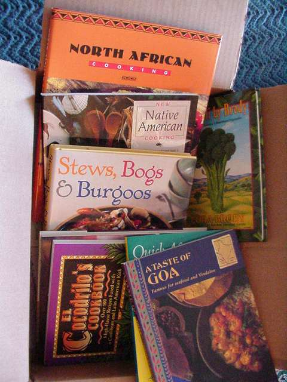

<!-- %%toc%% -->

# チャプター

{グループルビ|ぐるーぷるび}のテストです。{熟語ルビ|じゅく|ご|る|び}のテストです。

## セクション

空行を作成しない段落は、単なる改行になります。
　段落の最初に全角スペースをいれることで、段落の最初を表現します。

空行を開けた場合はこうなります。

### サブセクション

縦書き^横書き^縦書き

<!-- 改ページ(newpage) -->

=== 

<!-- 改ページ(clearpage) -->

====

<!-- 改ページ(cleardoublepage) -->

=====

# 番号なしチャプター {-}

<!-- %%onecolumn%% -->

ここは一カラムになります。ここは一カラムになります。ここは一カラムになります。ここは一カラムになります。ここは一カラムになります。ここは一カラムになります。ここは一カラムになります。ここは一カラムになります。ここは一カラムになります。ここは一カラムになります。ここは一カラムになります。ここは一カラムになります。ここは一カラムになります。ここは一カラムになります。ここは一カラムになります。ここは一カラムになります。ここは一カラムになります。ここは一カラムになります。ここは一カラムになります。

<!-- %%twocolumn%% -->

ここは二カラムになります。ここは二カラムになります。ここは二カラムになります。ここは二カラムになります。ここは二カラムになります。ここは二カラムになります。ここは二カラムになります。ここは二カラムになります。ここは二カラムになります。ここは二カラムになります。ここは二カラムになります。ここは二カラムになります。ここは二カラムになります。ここは二カラムになります。ここは二カラムになります。

ここは二カラムになります。ここは二カラムになります。ここは二カラムになります。ここは二カラムになります。ここは二カラムになります。ここは二カラムになります。ここは二カラムになります。ここは二カラムになります。ここは二カラムになります。ここは二カラムになります。ここは二カラムになります。ここは二カラムになります。ここは二カラムになります。ここは二カラムになります。ここは二カラムになります。

ここは二カラムになります。ここは二カラムになります。ここは二カラムになります。ここは二カラムになります。ここは二カラムになります。ここは二カラムになります。ここは二カラムになります。ここは二カラムになります。ここは二カラムになります。ここは二カラムになります。ここは二カラムになります。ここは二カラムになります。ここは二カラムになります。ここは二カラムになります。ここは二カラムになります。

